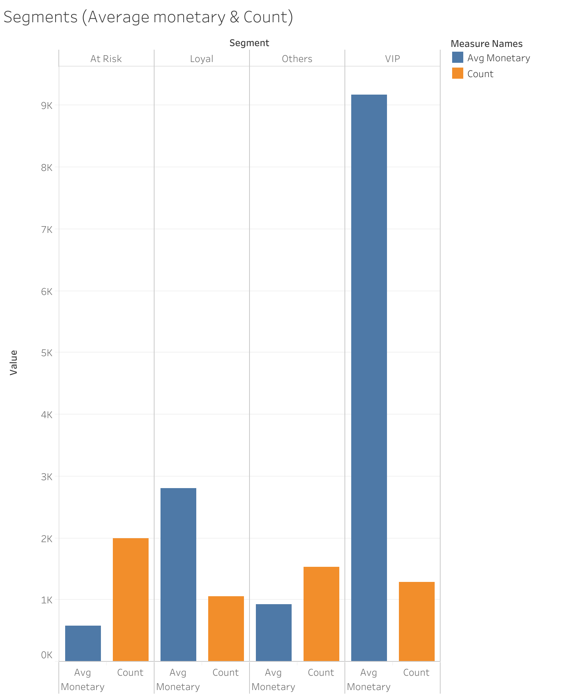
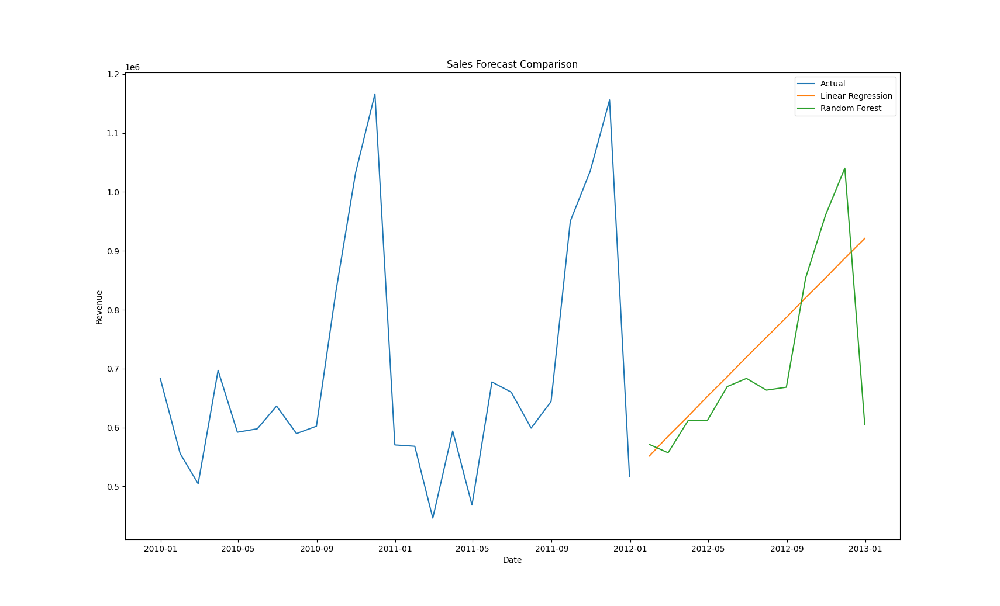

# E-commerce-Sales-Analysis

## Project Overview
This project analyzes e-commerce transaction data to identify revenue drivers, customer behavior, and business opportunities.

## Objectives
- Analyze sales performance
- Identify high-value customers
- Predict future revenue trends using Machine Learning
- Provide actionable business recommendations

## Tools Used
- Python (Pandas, Scikit-Learn, Matplotlib) – Data cleaning, Forecasting, and Classification
- R – Statistical Analysis
- Tableau – Data Visualization

## Key Insights

### 1. Customer Concentration
- Most of revenue comes from top 20% of customers
### 2. Product Performance
- A small number of products generate the majority of revenue
### 3. Sales Forecasting:
- Implemented Linear Regression and Random Forest Regressor to forecast 12 months of future revenue
- Analyzed time-based features (month, year, time index) to capture seasonality
### 4. Product Performance & Classification:
- Used a Random Forest Classifier to identify "at-risk" or "bad" products (bottom 25% of revenue)
- Identified that transaction frequency and total quantity are the primary predictors of product success

## Recommendations

- Focus on retaining high-value customers through loyalty programs
- Increase inventory before peak season
- Remove or discount underperforming products

## Dashboards

https://public.tableau.com/views/Top_10_by_items/Sheet1?:language=en-US&:sid=&:redirect=auth&:display_count=n&:origin=viz_share_link
https://public.tableau.com/views/Top10CountriesbyRevenue_17742459159930/Sheet1?:language=en-US&:sid=&:redirect=auth&:display_count=n&:origin=viz_share_link
https://public.tableau.com/views/Monthly_Revenue_17742483821730/Sheet1?:language=en-US&:sid=&:redirect=auth&:display_count=n&:origin=viz_share_link
https://public.tableau.com/views/SegmentsAveragemonetaryCount/Sheet1?:language=en-US&:sid=&:redirect=auth&:display_count=n&:origin=viz_share_link
https://public.tableau.com/views/KPIsummary_17742530268690/Sheet1?:language=en-US&:sid=&:redirect=auth&:display_count=n&:origin=viz_share_link

## Dataset
Online Retail II UCI (Kaggle)

## Author
Gennadii Barkhatov
